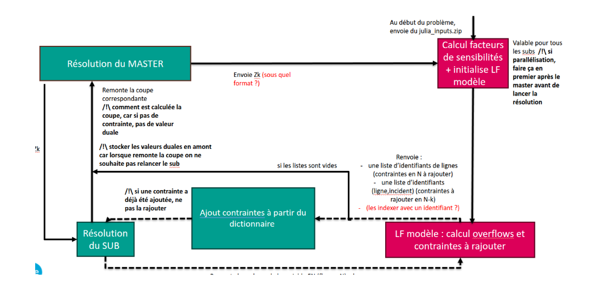

## Context 
Antares-xpansion uses in its core a the benders decomposition framework to find the optimal candidate lines.
It also implements the micro-iterations for micro iterations following the mechanism described in the image below : 



So the philosophy of the micro iterations is the following : 
At each iteration, we have a subset (of all canditate lines) that we find after solving the master problem. 
These new invested lines will give a new electrical grid topology, so we recompute the PTDF matrix of the new grid.
Initially the subproblems optimization problems are not set with the whole considered constraints. We start with smaller subproblems (therefore a faster resolution). Once the subproblem is solver, we evaluate if that solutions respects the constraints that we haven't initially injected. For the violated ones, we inject them into the optimization problem and we resolve them. We iterate until ending up with a solution that respects all constraints.


## Benders callBacks and the plugin mechanism : 
So mainly the Benders decomposition framework follows the following algorithm : 
- Solving the master optimization problem which is a MILP 
- Solving subproblems
- adding cuts into the subproblem 
- repearting until : best upper band - lower band < threshold 

We injected into that framework different call back 
- **OnBendersStart** : a callback fired when the Benders decomposition starts 
- **OnBendersEnd** : a callback fired when the Benders decomposition ends 
- **OnBendersIterationStart** : a callback fired before a full iteration (Master + sub probelems resolutions )
- **OnBendersIerationEnd** : a callback fired after a full iteration 
- **OnBendersIterationStart** : a callback fired before the master resolution 
- **OnBendersIterationEnd** : a callback fired after the master resolution 
- **OnBendersSubResolutionStart** : a callback fired before the resolution of each sub problem 
- **OnBendersSubResolutionEnd** : a callback fired after the resolution of each sub problem 
- **OnBendersMicroIterationStart** : a callback fired before each subproblem micro iteration 
- **OnBendersMicroIterationEnd** : a callback fired after each subproblem micro iteration 

these callback reads an external plugin through runtime dynamic linking (which we build in this project). This plugin enable the behaviour of computing the PTDF and the violated constraints for every subproblem.
This architecture allow keeping the Benders code completly decoupled from the modelisation aspect of the grid, making it extensible and reusable for teams that have different modelisation approach.

## Code architecture

The project builds a single artifact : `cpp_plugin.so`, the shared library that Antares-xpansion loads at runtime. Everything else is either support code or tests.

```
CMakeLists.txt        # top level build : MPI, Boost (mpi + serialization), Eigen3, nlohmann_json
├── cpp_plugin/       # the plugin itself -> cpp_plugin.so
├── utils/            # header + sources shared by the plugin and the tests (INTERFACE lib "utils")
└── tests/            # GoogleTest unit tests (fetched by CMake, built only with -DBUILD_TESTS=ON)
```

### `cpp_plugin/` — the plugin

- **`gridModelisation.h`** — all the grid modelling logic, held by the `Plugin` class :
  - *loading* : reads the pre-computed grid data from `plugin_inputs/inputs_micro_it` (dense `.bin`, sparse `.coo` COO triplets, `.json` name→index maps and dictionaries). Index maps are converted from Julia 1-based to C++ 0-based at load time.
  - *`compute_factors_for_micro_iterations(z_dict)`* — from the master's investment decisions, rebuilds the topology : removes the non-invested branches, updates `B⁻¹` with a low-rank (Woodbury) update, recomputes the PTDF, the HVDC sensitivity matrix and the N-K incident factors.
  - *`return_constraints_for_micro_iteration(sub, F_N_values)`* — from a subproblem solution, computes the N and N-K overflows, sorts them and returns at most `max_constraints_per_micro_it` constraint families to inject.
  - *`broadcast_factors()`* — MPI-broadcasts the factors computed on rank 0 to all the workers.
- **`micro_iters_cpp_plugin.cpp`** — the `extern "C"` boundary. It implements the `OnBenders*` callbacks listed above and does the plumbing only : reads the CSV dictionaries (`constraints_dictionary.csv`, `variables_dictionary.csv`, `investment_dictionary.csv`), holds the singleton `Plugin` and logger, maps solver variable indices to named flows, and deduplicates the constraint families already added to a given subproblem.

Where the work happens :

| Callback | Action |
|---|---|
| `OnBendersStart` | loads dictionaries, builds the `Plugin` and the logger |
| `OnBendersMasterResolutionEnd` | rank 0 recomputes PTDF / sensitivities / incident factors, then broadcasts them |
| `OnBendersIterationStart` | resets the per-subproblem "already added" constraint tracking |
| `OnBendersMicroIterationEnd` | detects the violated constraints and fills `constraints_to_add_vec` |

### `utils/`

- **`micro_iterations_logger.{h,cpp}`** — `MicroIterationsLog`, the logging of the master iterations and of the micro iterations (times, added constraint keys). Writes on a dedicated worker thread behind a task queue so the solver loop is never blocked by I/O. Exposed as an INTERFACE CMake target `utils`, linked both by the plugin and by the tests.

### `tests/`

GoogleTest is fetched by CMake (`FetchContent`, v1.15.2). Two suites :

- **`test_plugin.cpp`** — exercises the `Plugin` class against the reference grid data committed in `tests/unit_tests/test_utils/cpp_structures/` (the same `.bin` / `.coo` / `.json` layout the plugin expects at runtime).
- **`test_micro_iterations_logger.cpp`** — exercises the logger, run under `mpiexec -n 1`.

### Configuration

The plugin reads `micro_iterations_config.txt` (`key=value` per line) next to the run directory :

| Key | Meaning | Default |
|---|---|---|
| `max_constraints_per_micro_it` | max number of constraints injected per micro iteration | 200 |
| `add_N_constraint_first` | skip the N-K constraint of a branch already constrained in N | false |
| `tol_N` | tolerance factor on the N flow limit | 1.001 |
| `tol_N_K` | tolerance factor on the N-K flow limit | 1.0 |

### Build

```bash
cmake -B build -DBUILD_TESTS=ON
cmake --build build
ctest --test-dir build
```

